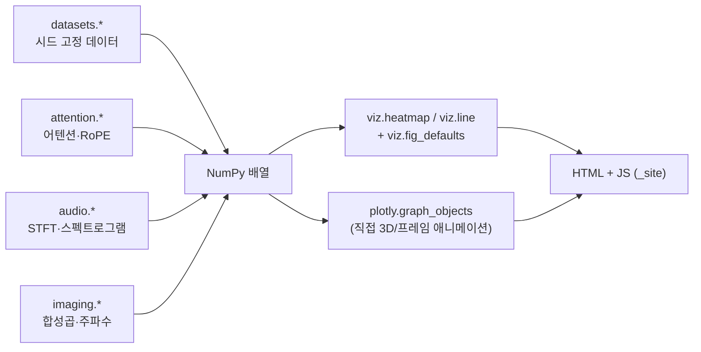

# API 레퍼런스 (`src/`)

`src/` 는 챕터(`.qmd`)에서 재사용하는 계산·시각화 모듈 모음입니다.
모든 모듈은 순수 함수 위주로 작성되어 있으며, 별도 상태를 갖지 않습니다.

임포트 예:

```python
import sys; sys.path.append("../..")   # 챕터에서 프로젝트 루트 기준
from src import viz, datasets, attention, audio, imaging
```

> **모듈은 필요할 때 늘어납니다.** 지금 있는 다섯 모듈은 현재 집필된 챕터가 실제로 쓰는 것들입니다.
> 새 챕터가 반복 계산을 요구하면 그때 모듈을 추가하되, 렌더 타임 의존성은 NumPy·SciPy·Plotly 로 유지합니다.

---

## `viz.py` — 공통 Plotly 헬퍼

모든 그래픽의 팔레트·레이아웃 관례를 정의합니다. 테마 `plotly_dark`, 폰트 Pretendard.

### 색상 상수

| 이름 | 값 | 용도 |
|------|-----|------|
| `ACCENT` | `#7ea8f7` | 주 대상 (파랑) |
| `WARM` | `#f7a07e` | 대비 대상 (주황) |
| `GREEN` | `#7ef7a0` | 결과·정답 |
| `YELLOW` | `#f7e07e` | 보조 강조 |
| `PINK` | `#f77eb8` | 네 번째 계열 |
| `PALETTE` | 위 5색 + 3색 | 계열형 데이터 순서 |
| `SEQUENTIAL` | `"Blues"` | 히트맵 기본 (단조 증가 값) |
| `DIVERGING` | `"RdBu"` | 부호가 의미를 갖는 값 |

### `hex_rgba(hex_color, alpha=0.15)`
`'#rrggbb'` → `'rgba(r,g,b,alpha)'`.

> ⚠️ **필수**: hex 색을 `str.replace()` 나 hex-alpha 접미사(`col + '1a'`)로 rgba 변환하면 Plotly가 `ValueError` 를 냅니다. 반투명 색이 필요하면 반드시 이 함수를 쓰세요.

### `color(i)`
계열 인덱스 → 팔레트 색 (길이를 넘으면 순환).

### `fig_defaults(fig, title="", height=450, **layout)`
Figure에 공통 레이아웃(테마, 폰트, 여백, 범례 스타일)을 일괄 적용하고 반환합니다.
**다른 헬퍼가 마지막에 호출**하며, 직접 만든 Figure에도 적용할 수 있습니다.
추가 레이아웃 키워드는 그대로 `update_layout` 에 전달됩니다.

### `annotate_box(fig, text, x=0.98, y=0.02, ...)`
그래프 모서리에 수치 요약 상자를 붙입니다(paper 좌표). `<br>` 로 줄바꿈.

### `slider(steps, prefix="", suffix="", active=0, pad_t=50)`
`update` 방식 슬라이더 하나를 만드는 축약 헬퍼.
`steps` 는 `[(label, {trace 속성 dict}), ...]` 형태입니다.

```python
fig.update_layout(sliders=[viz.slider(
    [(f"{k}", {"y": [ys[k]]}) for k in range(10)],
    prefix="차수 = ",
)])
```

### `play_buttons(duration=60, y=1.12, x=0.5)`
`fig.frames` 애니메이션용 재생/정지 버튼 `updatemenus` 항목.

### `heatmap(matrix, x_title, y_title, title, colorscale=None, zmid=None, height=460, text=None, hover=None)`
행렬 하나를 표준 스타일 히트맵으로. y축은 위→아래로 뒤집혀 있어 행렬 표기와 일치합니다.
`zmid=0` 을 주면 발산형 스케일의 중심이 0에 고정됩니다.

### `line(x, ys, labels=None, x_title, y_title, title, height=420, fill=False, dashes=None)`
여러 곡선을 한 축에. `fill=True` 면 반투명 채움을 추가합니다.

### `vector_field(X, Y, U, V, scale=0.15, color_=None, name="", step=1)`
2D 벡터장을 **`go.Scatter` 하나로** 반환합니다(선분 사이를 `None` 으로 끊음).
그래디언트 벡터장, 광류 등에 사용. `step` 으로 화살표 밀도를 줄입니다.

---

## `datasets.py` — 시드 고정 합성 데이터

외부 데이터셋을 내려받지 않습니다. 모든 생성기가 `seed` 를 받으므로
어느 PC에서 빌드해도 같은 그림이 나옵니다.

| 함수 | 반환 | 설명 |
|------|------|------|
| `polynomial(n=30, noise=0.25, x_range=(0,1), seed=0)` | `x, y, f_true` | 참 함수 sin(2πx). 다항 차수·과적합 실험 |
| `linear(n=60, slope=2, intercept=1, noise=1, ...)` | `x, y` | 기울기·절편이 알려진 선형 데이터 |
| `blobs(n=300, centers=..., spread=0.8, seed=0)` | `X (n,2), labels` | 등방 가우스 군집 |
| `two_moons(n=300, noise=0.15, seed=0)` | `X (n,2), labels` | 선형 분리 불가 고전 예제 |
| `correlated_gaussian(n=400, rho=0.8, seed=0)` | `(n,2)` | 지정 상관계수의 2D 정규 표본 |
| `image_grid(size=64)` | `(size,size)` | 원·사각형·줄무늬·그래디언트를 합친 테스트 이미지, 값 `[0,1]` |

```python
x, y, f_true = datasets.polynomial(n=30, seed=0)
X, labels = datasets.two_moons(n=200, seed=1)
```

---

## `attention.py` — 어텐션 NumPy 참조 구현

Part 5(트랜스포머)가 실제 숫자를 계산할 때 쓰는 모듈.
프레임워크 없이 순수 NumPy 로 작성되어 수식과 코드가 1:1 대응합니다.
표기: `n` 시퀀스 길이, `d` 모델 차원, `h` 헤드 수, `d_k = d/h`.

### `softmax(z, axis=-1)`
최댓값을 빼고 지수화하는 수치 안정 softmax. 큰 로짓에서도 `inf`/`NaN` 이 나오지 않습니다.

### `scaled_dot_product_attention(Q, K, V, mask=None, scale=True)`
$\text{Attention}(Q,K,V) = \text{softmax}(QK^\top/\sqrt{d_k})V$

| 파라미터 | 형태 | 설명 |
|----------|------|------|
| `Q` | `(n_q, d_k)` | 질의 |
| `K` | `(n_k, d_k)` | 키 |
| `V` | `(n_k, d_v)` | 값 |
| `mask` | `(n_q, n_k)` bool | `True` 인 위치를 가림(점수를 −inf로) |
| `scale` | bool | `False` 면 √d_k 로 나누지 않음 (스케일링 효과 비교용) |

**반환**: `(out, attn)` — `out` shape `(n_q, d_v)`, `attn` shape `(n_q, n_k)` (행 합 = 1).

### `causal_mask(n)` / `padding_mask(lengths, n)`
`(n, n)` 인과 마스크(상삼각 `True`), 가변 길이 배치용 패딩 마스크.

### `multi_head_attention(X, Wq, Wk, Wv, Wo, n_heads, mask=None)`
멀티헤드 셀프 어텐션 한 층. `X (n,d)`, 사영 행렬은 모두 `(d,d)`.
**반환**: `(out (n,d), attn (h,n,n))`.

### `sinusoidal_encoding(n, d, base=10000.0)`
원 논문의 사인파 절대 위치 인코딩. **반환** `(n, d)`.

### `rope_angles(n, d_k, base=10000.0)` / `apply_rope(X, base=10000.0)`
RoPE 회전각과 적용. `apply_rope` 는 인접 차원 쌍을 위치에 따라 복소평면에서 회전시킵니다.
회전은 노름을 보존하고, 회전 후 내적은 **상대 위치에만** 의존합니다.

### `alibi_bias(n, slope)`
거리 비례 선형 바이어스 `(n,n)`. 점수에 더해 멀리 있는 키를 감쇠시킵니다.

### `attention_flops(n, d, n_heads=1)`
어텐션 한 층의 연산량 분해와 어텐션 행렬 메모리(float32 바이트).
**반환** dict: `qkv_proj`, `scores`, `weighted_sum`, `out_proj`, `total`, `attn_bytes`.

```python
out, attn = attention.scaled_dot_product_attention(Q, K, V, mask=attention.causal_mask(n))
assert np.allclose(attn.sum(axis=1), 1)
```

---

## `audio.py` — 신호 생성과 시간-주파수 변환

| 함수 | 설명 |
|------|------|
| `time_axis(duration, sr)` | 시간 축 배열 |
| `tone(freq, duration=1, sr=16000, amp=1, phase=0)` | 단일 정현파 |
| `harmonic_tone(f0, n_harmonics=6, ..., decay=1.0)` | 배음 구조를 갖는 음 (음색 실험) |
| `chirp(f0=200, f1=4000, ...)` | 선형 주파수 스윕 — 스펙트로그램에서 대각선 |
| `am_tone(carrier=800, mod=5, ...)` | 진폭 변조음 (엔벨로프 실험) |
| `window(name, N)` | `rect` / `hann` / `hamming` / `blackman` |
| `dft_magnitude(x, sr)` | `(freqs, mag)` 단측 크기 스펙트럼 |
| `stft(x, n_fft=512, hop=128, win="hann")` | `(n_freq, n_frames)` 복소 스펙트럼 |
| `stft_axes(x, sr, n_fft, hop)` | `stft()` 결과에 대응하는 `(시간초, 주파수Hz)` |
| `spectrogram_db(S, floor_db=-80, ref=None)` | 복소 스펙트럼 → dB 크기 (하한 클리핑) |
| `resample_naive(x, sr_from, sr_to)` | **안티에일리어싱 없는** 단순 재추출 |
| `quantize(x, bits)` | 균등 양자화 (비트 깊이 실험) |

> ⚠️ `resample_naive` 는 **에일리어싱을 눈으로 보여주기 위해 일부러 필터를 생략한** 구현입니다. 실제 리샘플링에는 `scipy.signal.resample_poly` 를 쓰세요.

```python
ch = audio.chirp(200, 4000, 0.5, sr=16000)
S = audio.stft(ch, n_fft=512, hop=128)
t, f = audio.stft_axes(ch, 16000, 512, 128)
fig = viz.heatmap(audio.spectrogram_db(S))
```

---

## `imaging.py` — 영상처리 기본 연산

### `KERNELS`
고전 3×3 커널 딕셔너리: `항등`, `박스 블러`, `샤픈`, `소벨 x`, `소벨 y`, `라플라시안`, `엠보스`.

### `gaussian_kernel(size=5, sigma=1.0)`
정규화된 2D 가우시안 커널.

### `convolve2d(img, kernel, pad="edge")`
2D 상호상관. 슬라이딩 윈도우 뷰 + `einsum` 으로 벡터화되어 있습니다.

> 수학적 합성곱은 커널을 180° 뒤집지만, 커널을 **학습하는** 신경망에서는 그 차이가 흡수되므로 프레임워크들도 이 형태를 씁니다.

### `gradient_magnitude(img)`
**반환** `(gm, gx, gy)` — 소벨 그래디언트 크기와 x/y 성분.

### `fft2_shifted(img)` / `spectrum_db(F, floor_db=-60)`
저주파를 중심으로 옮긴 2D 스펙트럼과 dB 크기(표시용).

### `frequency_filter(img, cutoff, mode="low")`
주파수 영역 원형 마스크 필터링. `cutoff` 는 0~1 반지름 비율,
`mode` 는 `"low"`(흐려짐) 또는 `"high"`(윤곽만).

### `downsample(img, factor=2)` / `gaussian_pyramid(img, levels=4, sigma=1.0)`
평균 풀링 다운샘플과 가우시안 피라미드.

### `receptive_field(n_layers, kernel=3, stride=1)`
층을 쌓을 때 한 뉴런이 보는 입력 영역 크기의 목록.
`receptive_field(4)` → `[3, 5, 7, 9]`.

---

## 사용 패턴 요약



새 그래픽을 만들 때는 먼저 `viz.line` / `viz.heatmap` 으로 되는지 보고,
슬라이더·프레임처럼 세밀한 제어가 필요할 때만 `go.Figure` 를 직접 쓰되
마지막에 `viz.fig_defaults(fig, ...)` 를 통과시키세요.
