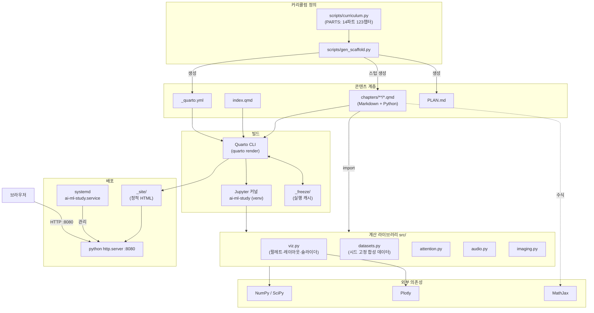
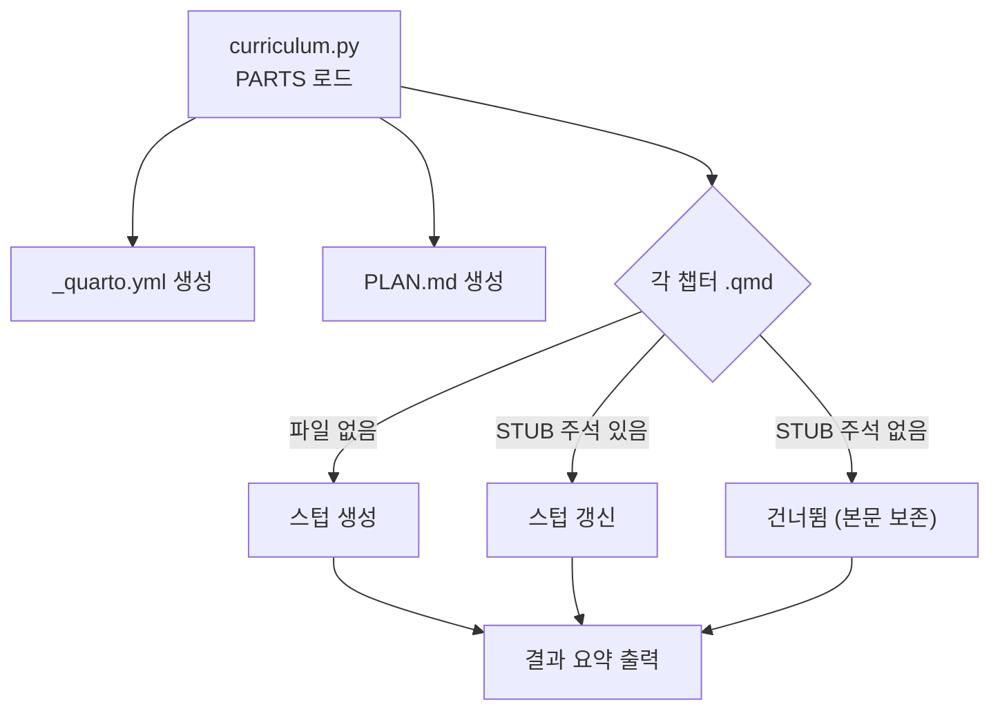
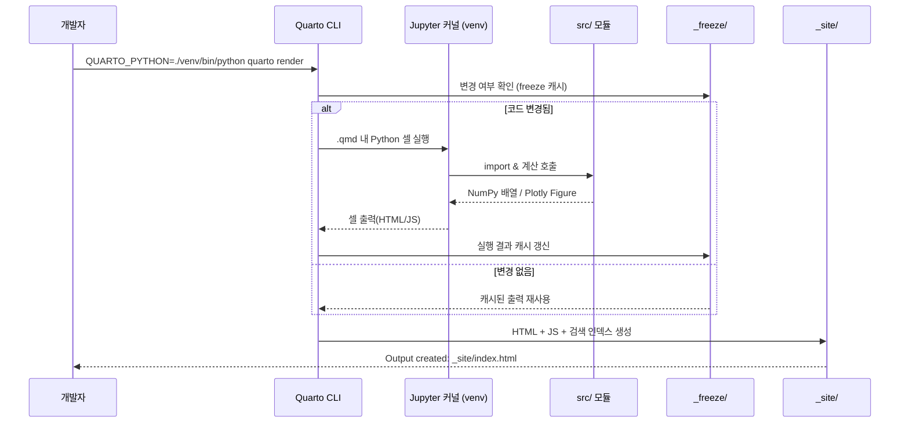
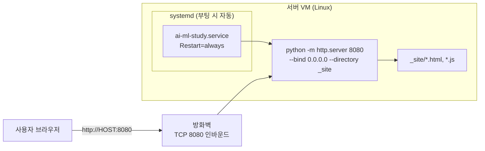

# 아키텍처 (Architecture)

이 문서는 **AI/ML 학습 책** 프로젝트의 전체 구조, 빌드 파이프라인, 배포 아키텍처를 설명합니다.

---

## 1. 개요

프로젝트는 **커리큘럼 정의**, **콘텐츠(교재)**, **재사용 계산 라이브러리**, **정적 사이트 빌드/배포**의 네 축으로 구성됩니다.

- 커리큘럼(123챕터의 목차·이론 항목·그래픽 목록)은 `scripts/curriculum.py` 한 곳에 정의됩니다.
- 거기서 `_quarto.yml`(목차), `chapters/**/*.qmd`(스텁), `PLAN.md`(플래닝 문서)가 생성됩니다.
- 콘텐츠는 Quarto `.qmd` 파일(Markdown + Python 코드 블록)로 작성됩니다.
- 각 챕터의 Python 코드는 `src/` 모듈을 호출해 계산하고, Plotly로 인터랙티브 그래픽을 생성합니다.
- Quarto가 `.qmd` 를 실행·렌더링하여 정적 HTML 사이트(`_site/`)를 만듭니다.
- `_site/` 는 Python `http.server` 로 서빙되며, Linux 서버에서는 systemd 서비스로 상시 구동됩니다.

핵심 설계 원칙:

| 원칙 | 내용 |
|------|------|
| **커리큘럼 단일 진실 원천** | 123챕터의 목차·스텁·플래닝을 손으로 동기화하지 않는다. `curriculum.py` 하나만 고친다 |
| **콘텐츠/로직 분리** | 반복 계산은 `src/` 에 모으고, `.qmd` 는 서술과 시각화 호출에 집중 |
| **재현 가능한 빌드** | 고정된 venv + `QUARTO_PYTHON`, 합성 데이터 시드 고정, `_freeze/` 로 실행 결과 캐시 |
| **얇은 의존성** | 렌더 타임 의존성은 NumPy·SciPy·Plotly 뿐. 프레임워크 없이 전체가 빌드된다 |
| **정적 배포** | 서버 사이드 로직 없음. 순수 정적 파일 → 단순하고 안정적 |

---

## 2. 컴포넌트 구조



---

## 3. 스캐폴드 생성 파이프라인

`gen_scaffold.py` 는 세 산출물을 만들되, **본문이 채워진 챕터는 절대 덮어쓰지 않습니다.**



보호 장치는 스텁 최상단의 주석 한 줄입니다:

```
<!-- STUB: scripts/gen_scaffold.py 가 생성한 뼈대입니다. 본문을 채우면 이 줄을 지우세요. -->
```

집필을 시작할 때 이 줄을 지우면, 이후 커리큘럼을 재생성해도 그 챕터는 그대로 남습니다.

---

## 4. 빌드 파이프라인



- **`_freeze/`**: 각 `.qmd` 의 코드 실행 결과를 캐싱해, 변경되지 않은 챕터는 재실행하지 않아 빌드가 빨라집니다. 123챕터 규모에서는 이 캐시가 필수입니다.
- **`QUARTO_PYTHON`**: 시스템 파이썬이 아닌 프로젝트 `venv` 를 커널로 강제 지정합니다.

---

## 5. 계산은 빌드 타임, 인터랙션은 런타임

1. Quarto가 `.qmd` 의 Python 셀을 커널에서 실행.
2. 셀은 `src/datasets` 로 시드 고정 데이터를 만들고, `src/attention`·`src/audio`·`src/imaging` 등으로 계산.
3. 결과를 `src/viz` 헬퍼 또는 직접 `plotly.graph_objects` 로 Figure 화.
4. Plotly가 Figure를 HTML+JS로 직렬화 → 브라우저에서 슬라이더·애니메이션이 **클라이언트 측에서** 동작.
5. LaTeX 수식은 MathJax가 브라우저에서 렌더링.

> 즉, **계산은 빌드 타임**(Python), **인터랙션은 런타임**(브라우저 JS)에서 일어납니다.
> 배포 서버에는 파이썬 계산이 전혀 필요 없습니다.

이 구조 때문에 슬라이더 스텝은 **미리 계산된 상태 집합**이어야 합니다.
연속적인 파라미터를 다룰 때는 이산 스텝을 미리 만들어 `frames` 또는 `sliders.steps` 에 넣습니다.

---

## 6. 배포 아키텍처



- 서버 사이드 렌더링/DB 없이 **정적 파일만** 서빙 → 공격 표면이 작고 장애 지점이 적습니다.
- systemd 유닛은 `scripts/install-service.sh` 가 프로젝트 경로 기준으로 동적 생성합니다.
- Windows에는 systemd 가 없으므로 `scripts/serve.ps1` 로 그때그때 띄웁니다(127.0.0.1 바인딩).

---

## 7. 디렉터리 책임 분담

| 경로 | 책임 |
|------|------|
| `scripts/curriculum.py` | 커리큘럼 단일 진실 원천 (파트·챕터·이론 항목·그래픽 목록) |
| `scripts/gen_scaffold.py` | 위로부터 `_quarto.yml` / `PLAN.md` / 챕터 스텁 생성 |
| `_quarto.yml` | 챕터 순서, 테마(dark/light), 포맷(toc, code-fold 등) — **자동 생성** |
| `PLAN.md` | 챕터별 상세 플래닝 — **자동 생성** |
| `index.qmd` | 표지 및 커리큘럼 안내 (손으로 관리) |
| `chapters/NN_topic/*.qmd` | 각 주제의 이론 서술 + Python 시각화 코드 |
| `src/*.py` | 순수 계산·플롯 로직 (콘텐츠 비의존, 단위 테스트 가능) |
| `scripts/*.ps1` / `*.sh` | 빌드·미리보기·렌더 검사, systemd 서비스 수명주기 관리 |
| `custom.scss`, `styles.css` | 폰트·색상 등 프리젠테이션 |
| `_freeze/` | 코드 실행 캐시 (빌드 산출물) |
| `_site/` | 최종 정적 사이트 (배포 대상) |
| `venv/` | 격리된 Python 런타임 |

---

## 8. 커리큘럼을 바꿀 때


챕터를 **재배치**하면 스텁의 이전/다음 링크가 자동으로 갱신되지만,
**본문을 채운 챕터의 링크는 갱신되지 않습니다**(생성기가 건드리지 않으므로).
대규모 재배치 후에는 완본 챕터의 내비게이션 링크를 손으로 확인해야 합니다.
