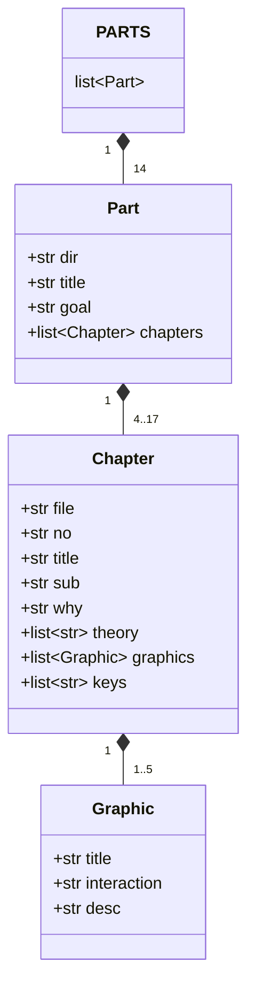
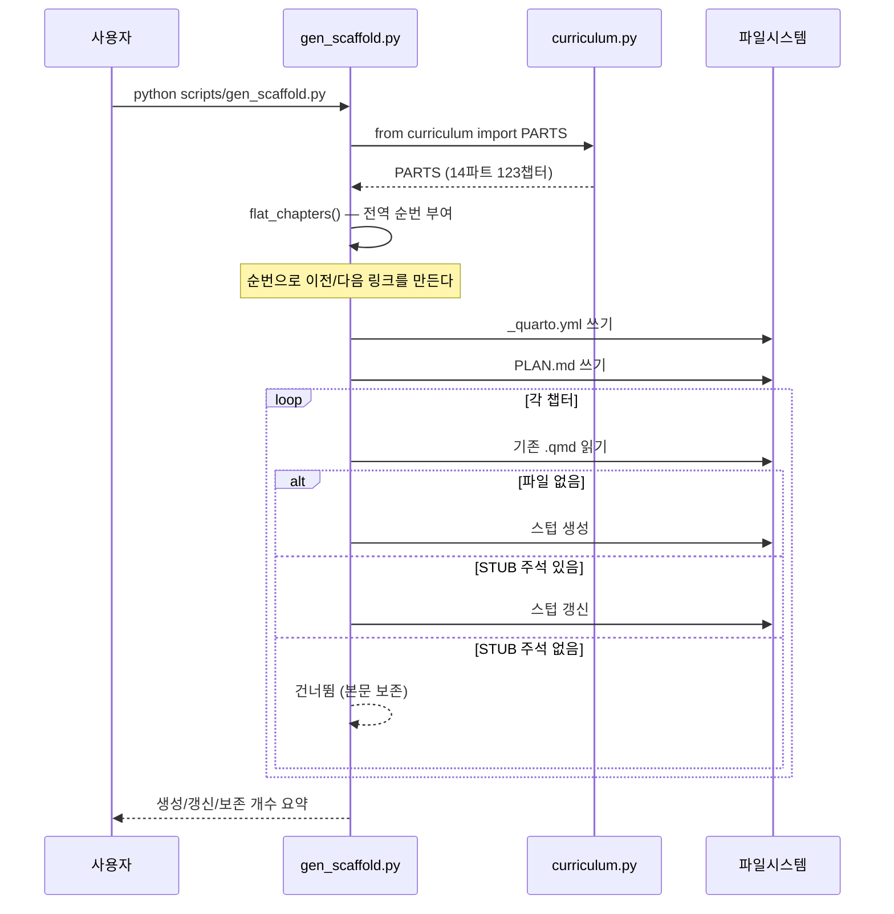
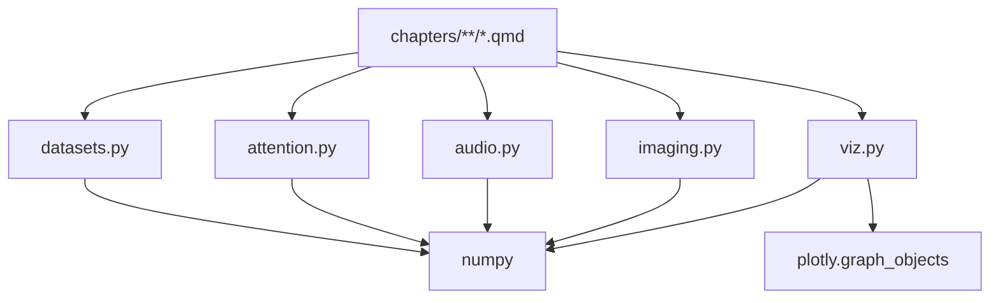
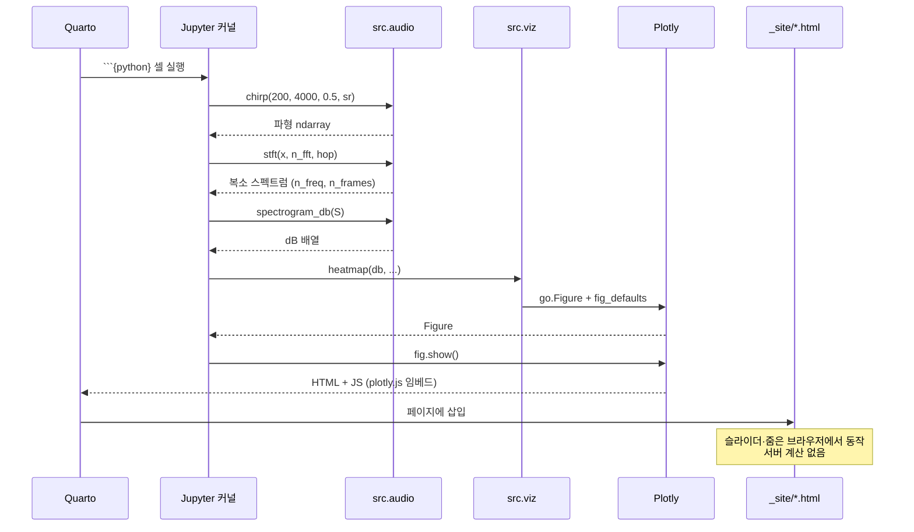
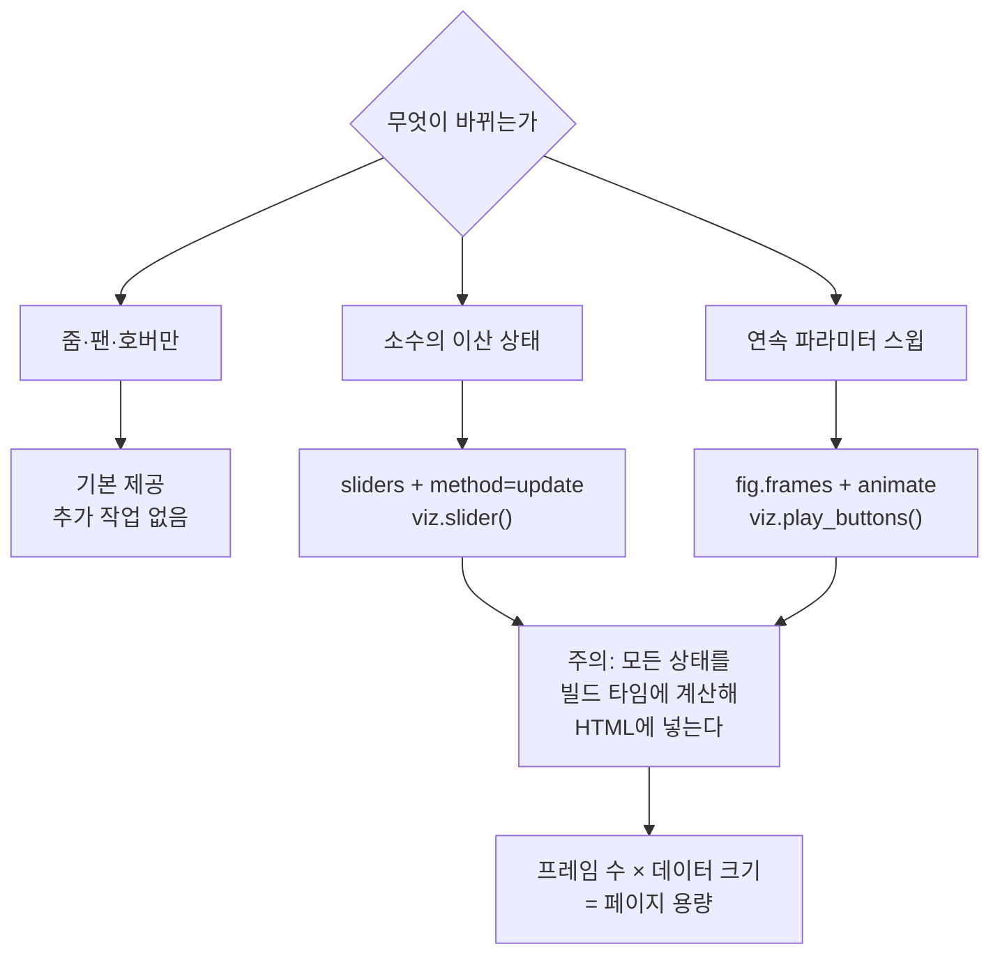
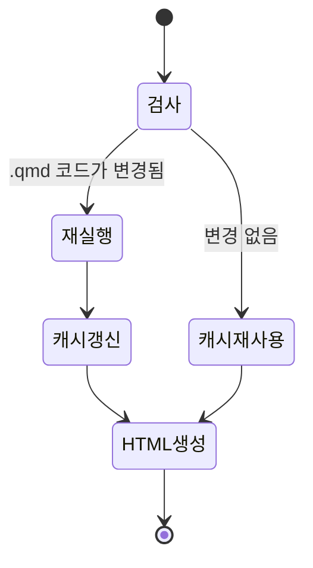

# 데이터 흐름과 구조 다이어그램

`src/` 모듈과 빌드 파이프라인의 관계를 다이어그램으로 정리합니다.
(개념 설명은 [architecture.md](architecture.md), 함수 시그니처는 [api.md](api.md) 참고)

---

## 1. 커리큘럼 데이터 구조

`scripts/curriculum.py` 의 `PARTS` 는 중첩 dict/list 입니다.
`gen_scaffold.py` 는 이 구조만 알면 되고, 다른 어떤 파일도 참조하지 않습니다.

각 필드의 쓰임:

| 필드 | `_quarto.yml` | 챕터 스텁 | `PLAN.md` |
|------|---------------|-----------|-----------|
| `Part.dir` | 경로 | 경로 | 코드 표기 |
| `Part.title` | `part:` 제목 | — | 절 제목 |
| `Part.goal` | — | — | 파트 목표 인용문 |
| `Chapter.no` | — | front matter title | 소제목, 그래픽 ID 접두사 |
| `Chapter.sub` | — | `subtitle` | 이탤릭 부제 |
| `Chapter.why` | — | 도입 문단 | 도입 문단 |
| `Chapter.theory` | — | "이 장에서 다루는 것" 목록 | 이론 내용 목록 |
| `Chapter.graphics` | — | `G{no}.{i}` 절 + 자리표시자 | 그래픽 표 |
| `Chapter.keys` | — | 핵심 용어 표 | 핵심 용어 줄 |

---

## 2. 생성기 흐름

---

## 3. `src/` 모듈 의존 관계

모듈 사이에는 의존이 **없습니다**. 모두 NumPy 에만 의존하고, `viz` 만 Plotly 를 씁니다.
챕터가 이들을 조합합니다.

이 평평한 구조는 의도된 것입니다 — 챕터 하나가 필요한 모듈만 임포트하면 되고,
모듈을 삭제·교체해도 다른 모듈이 깨지지 않습니다.

---

## 4. 챕터 하나가 렌더되는 과정

Part 8.1(푸리에·STFT)을 예로 든 실제 호출 흐름:

---

## 5. 인터랙션 구현 방식 선택

Plotly 정적 내보내기에서 인터랙션을 만드는 방법은 세 가지이고, 비용이 다릅니다.

**실무 기준**: 프레임 수는 60~100개, 프레임당 데이터 점은 수백 개 이하로 유지합니다.
그 이상이 필요하면 데이터를 다운샘플하거나, 파라미터 축을 슬라이더 하나로 줄이세요.

---

## 6. 빌드 캐시(`_freeze/`)의 동작

123챕터를 매번 전부 실행하면 빌드가 감당이 안 됩니다. `execute.freeze: auto` 가 이를 막습니다.

- `src/` 를 고쳐도 `.qmd` 가 그대로면 **캐시가 재사용됩니다**(Quarto 는 `.qmd` 변경만 감지).
  모듈을 수정한 뒤에는 영향받는 챕터를 `render-check` 로 강제 렌더하거나 `_freeze/` 를 지우세요.
- `_freeze/` 는 `.gitignore` 에 있습니다. 클린 빌드는 항상 전체 재실행입니다.
